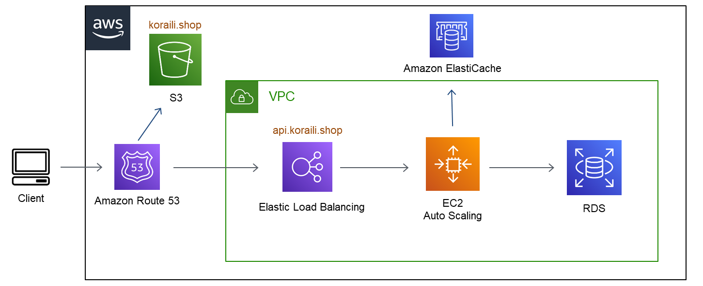

# 항공예약 시스템

### 예약시스템 시연 영상

### 기능
1. 회원가입
2. 로그인
    * JWT 인증
3. 개인정보변경
4. 항공권 예약
    * 동시접속 1명으로 설정
    * 동시접속자 이외에는 대기하여 앞에 예약자가 처리가 끝나면 예약가능
    * 예약 제한시간은 30초
5. 예약된 항공권 확인
    * 예약 취소 포함

### 목적
1. 개인 포트폴리오 용도로 제작
2. 백엔드 포지션으로 이직
3. Node, Typescript, 인프라 등 백엔드 기술 학습 목적

### 프론트엔드 기술스택
1. React
2. Redux
3. Styled-Components

### 백엔드 기술스택
1. Nodejs
2. NestJs
3. TypeORM
4. WebSocket
5. Mysql, Redis
6. AWS 환경(Terraform 사용)

### AWS 인프라 구성도

* 클라이언트는 S3, 서버는 EC2 AutoScaling Group에 배포
* 서버배포는 CodeDeploy 사용
* 인프라코드는 terraform 사용
