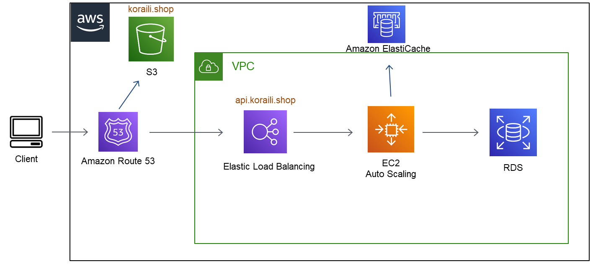

# 항공예약 시스템

### 예약시스템 시연 영상
유튜브 영상 임베드

### 목적
1. 개인 포트폴리오 용도로 제작
2. 백엔드 포지션으로 이직
3. Node, Typescript, 인프라 등 백엔드 기술 학습 목적

### 프론트엔드 기술스택
1. React
2. Redux
3. Styled-Components

### 백엔드 기술스택
1. Nodejs
2. JestJs
3. TypeORM
4. WebSocket
5. Mysql
6. AWS 환경

### AWS 인프라 구성도

* 클라이언트는 S3, 서버는 EC2 AutoScaling Group에 배포
* 서버배포는 CodeDeploy 사용
* 인프라코드는 terraform 사용